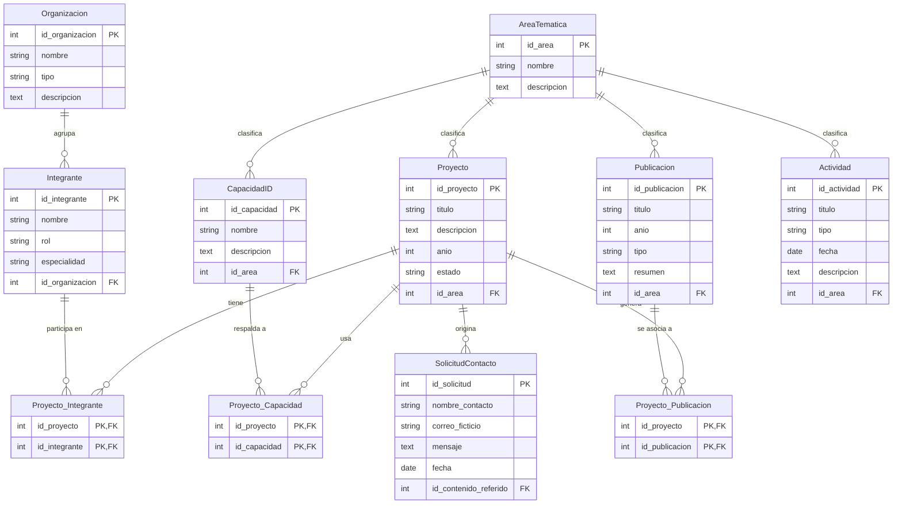

# 05 · Modelo de datos

## Diagrama entidad-relación

**Cardinalidades:** las relaciones Proyecto–Integrante, Proyecto–CapacidadID y Proyecto–Publicacion son de muchos a muchos y se resuelven con las tablas intermedias `Proyecto_Integrante`, `Proyecto_Capacidad` y `Proyecto_Publicacion`, cuya clave primaria es compuesta (las dos claves foráneas). El resto son de uno a muchos.

**Nota sobre `SolicitudContacto`:** en el flujo del MVP el contacto se inicia desde el detalle de un proyecto, por lo que `id_contenido_referido` referencia a `Proyecto.id_proyecto`.

## Diccionario de datos

### AreaTematica

| Atributo | Tipo | Descripción | RF que lo exige |
|---|---|---|---|
| id_area (PK) | int | Identificador único del área temática. | RF-05, RF-14, RF-15 |
| nombre | string | Nombre del área, usado como opción de filtro. | RF-05, RF-14 |
| descripcion | text | Explicación breve del área. | RF-05 |

### Organizacion

| Atributo | Tipo | Descripción | RF que lo exige |
|---|---|---|---|
| id_organizacion (PK) | int | Identificador único de la organización. | RF-12 |
| nombre | string | Nombre ficticio de la organización a la que pertenece un integrante. | RF-12 |
| tipo | string | Tipo de organización (por ejemplo, universidad o empresa). | RF-12 |
| descripcion | text | Descripción breve de la organización. | RF-12 |

### Proyecto

| Atributo | Tipo | Descripción | RF que lo exige |
|---|---|---|---|
| id_proyecto (PK) | int | Identificador único del proyecto. | RF-01, RF-10, RF-11 |
| titulo | string | Título del proyecto. | RF-01, RF-03, RF-08 |
| descripcion | text | Descripción del proyecto. | RF-03, RF-08 |
| anio | int | Año del proyecto. | RF-01, RF-05, RF-08 |
| estado | string | Estado del proyecto (por ejemplo, en curso o finalizado). | RF-08 |
| id_area (FK) | int | Área temática del proyecto, referencia a AreaTematica. | RF-05, RF-08, RF-15 |

### CapacidadID

| Atributo | Tipo | Descripción | RF que lo exige |
|---|---|---|---|
| id_capacidad (PK) | int | Identificador único de la capacidad I+D. | RF-10, RF-11 |
| nombre | string | Nombre de la capacidad. | RF-01, RF-03, RF-10 |
| descripcion | text | Descripción de la capacidad. | RF-03, RF-11 |
| id_area (FK) | int | Área temática de la capacidad, referencia a AreaTematica. | RF-05 |

### Publicacion

| Atributo | Tipo | Descripción | RF que lo exige |
|---|---|---|---|
| id_publicacion (PK) | int | Identificador único de la publicación. | RF-10, RF-11 |
| titulo | string | Título de la publicación. | RF-01, RF-03, RF-10 |
| anio | int | Año de publicación. | RF-01, RF-05 |
| tipo | string | Tipo de publicación (por ejemplo, artículo o informe). | RF-11 |
| resumen | text | Resumen de la publicación. | RF-03, RF-11 |
| id_area (FK) | int | Área temática de la publicación, referencia a AreaTematica. | RF-05 |

### Integrante

| Atributo | Tipo | Descripción | RF que lo exige |
|---|---|---|---|
| id_integrante (PK) | int | Identificador único del integrante. | RF-10, RF-11 |
| nombre | string | Nombre ficticio del integrante. | RF-01, RF-03, RF-10 |
| rol | string | Rol del integrante (por ejemplo, investigador o coordinador). | RF-11 |
| especialidad | string | Especialidad del integrante. | RF-03, RF-11 |
| id_organizacion (FK) | int | Organización del integrante, referencia a Organizacion. | RF-12 |

### Actividad

| Atributo | Tipo | Descripción | RF que lo exige |
|---|---|---|---|
| id_actividad (PK) | int | Identificador único de la actividad. | RF-13 |
| titulo | string | Título de la actividad. | RF-01, RF-03, RF-13 |
| tipo | string | Evento, formación u oportunidad de colaboración. | RF-13 |
| fecha | date | Fecha de la actividad. | RF-13 |
| descripcion | text | Descripción de la actividad. | RF-03 |
| id_area (FK) | int | Área temática de la actividad, referencia a AreaTematica. | RF-14, RF-15 |

### SolicitudContacto

| Atributo | Tipo | Descripción | RF que lo exige |
|---|---|---|---|
| id_solicitud (PK) | int | Identificador único de la solicitud simulada. | RF-18 |
| nombre_contacto | string | Nombre de la persona que envía la solicitud. | RF-16, RF-17, RF-18 |
| correo_ficticio | string | Correo ficticio de contacto, validado por formato. | RF-16, RF-17, RF-18 |
| mensaje | text | Mensaje de la solicitud. | RF-16, RF-17, RF-18 |
| fecha | date | Fecha en que se registra la solicitud. | RF-18 |
| id_contenido_referido (FK) | int | Proyecto desde el que se inició el contacto, referencia a Proyecto. | RF-16, RF-18 |

### Proyecto_Integrante

| Atributo | Tipo | Descripción | RF que lo exige |
|---|---|---|---|
| id_proyecto (PK, FK) | int | Proyecto en el que participa el integrante, referencia a Proyecto. | RF-10, RF-11 |
| id_integrante (PK, FK) | int | Integrante que participa en el proyecto, referencia a Integrante. | RF-10, RF-11 |

### Proyecto_Capacidad

| Atributo | Tipo | Descripción | RF que lo exige |
|---|---|---|---|
| id_proyecto (PK, FK) | int | Proyecto que usa la capacidad, referencia a Proyecto. | RF-10, RF-11 |
| id_capacidad (PK, FK) | int | Capacidad asociada al proyecto, referencia a CapacidadID. | RF-10, RF-11 |

### Proyecto_Publicacion

| Atributo | Tipo | Descripción | RF que lo exige |
|---|---|---|---|
| id_proyecto (PK, FK) | int | Proyecto que origina la publicación, referencia a Proyecto. | RF-10, RF-11 |
| id_publicacion (PK, FK) | int | Publicación asociada al proyecto, referencia a Publicacion. | RF-10, RF-11 |
